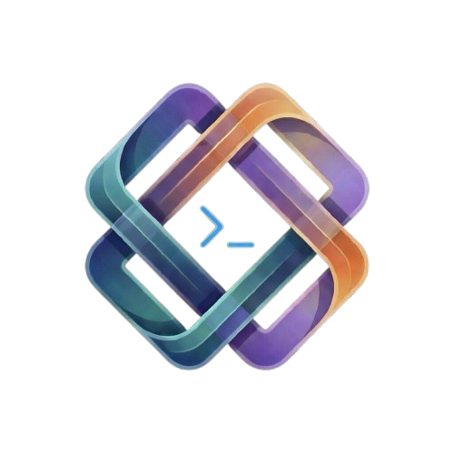

<p align="center">
  
</p>

<h1 align="center">Synctx</h1>

<p align="center">
  <em>Pronounced "sync-tex" — Sync + Context</em>
</p>

<p align="center">
  <strong>A secure, cross-device session synchronizer for GitHub Copilot CLI and Claude Code CLI.</strong>
</p>

<p align="center">
  <a href="#quick-start"></a>
  <a href="LICENSE"></a>
  <a href="GUIDE.md#security"></a>
  <a href="#prerequisites"></a>
</p>

## What is Synctx?

Synctx keeps your AI coding sessions in sync across devices. It runs silently in the background, automatically capturing your conversation history and syncing it to a **private Git repository under your GitHub account** — so you can pick up right where you left off, on any machine.

### Why?

When you use AI coding assistants like GitHub Copilot CLI, each session builds up valuable context — problem understanding, decisions made, code discussed. But that context is trapped on one machine. If you switch devices, start a new terminal, or your session crashes, it's gone.

Synctx solves this by:

- **Syncing automatically** — hooks into Copilot CLI's lifecycle events (every prompt, every tool call, every session close) to push session state to your private repo
- **Scanning for secrets** — every sync is scanned by [Gitleaks](https://github.com/gitleaks/gitleaks) before pushing. Detected secrets are auto-redacted so they never leave your machine
- **Tagging sessions** — assign friendly names to sessions, then restore them by tag on any machine
- **Restoring with one command** — `synctx restore <tag>` pulls the session and launches Copilot CLI with it, or hot-loads the context into your current conversation
- **Protecting deletions** — deleted, pruned, and cleaned sessions are tombstoned so they are never re-synced from other machines

**Example tags:**
```
synctx tag e0e9f4b8 auth-refactor       # brainstorming auth redesign
synctx tag 3ff1181a bugfix-api-timeout   # fixing API timeout in payments service
synctx tag a361960e onboarding-repo-xyz  # onboarding to a new codebase
synctx restore auth-refactor             # resume on any machine
```

### When is it useful?

- You work across **multiple machines** (desktop + laptop, work + home)
- You want to **resume a past session** days or weeks later
- You need to **share context** between Copilot CLI and Claude Code CLI sessions
- You want an **audit trail** of all AI interactions with secret scanning
- You run **Copilot CLI in automation** (CI/CD, batch tasks) and want to capture all sessions for analysis, auditing, or reuse

> Synctx supports **Windows**, **macOS**, and **Linux**. All platforms have full PATH augmentation for Copilot CLI hooks — Homebrew, nvm, snap, winget, and other common tool locations are auto-detected.

---

## Prerequisites

| Tool | Purpose |
|------|---------|
| [Node.js](https://nodejs.org/) v18+ | Runtime |
| [GitHub CLI (`gh`)](https://cli.github.com/) | Authenticated via `gh auth login` |
| [Gitleaks](https://github.com/gitleaks/gitleaks#installing) | Secret scanning |

> **Windows note:** Copilot CLI requires [PowerShell Core (pwsh)](https://aka.ms/powershell) to run hooks and skills. If you see a pwsh error, install it via `winget install Microsoft.PowerShell`.
>
> **macOS note:** Synctx auto-detects Homebrew paths (`/opt/homebrew/bin` on Apple Silicon, `/usr/local/bin` on Intel) and nvm-managed Node.js. If tools are installed elsewhere, ensure they're in your PATH.

---

## Quick Start

### One-Line Install

**Windows (PowerShell):**

```powershell
irm https://raw.githubusercontent.com/adsathye/synctx/main/setup.ps1 | iex
```

**macOS / Linux (Bash):**

```bash
curl -fsSL https://raw.githubusercontent.com/adsathye/synctx/main/setup.sh | bash
```

These download Synctx, install the Copilot CLI plugin, create the global `synctx` command, and run interactive setup — all in one step.

> **Claude Code CLI:** Full Claude Code CLI integration is under development and coming soon. Session data syncing (staging, scanning, push) already works for Claude Code CLI directories, but automatic hooks, session restore with auto-launch, and standalone installation (without Copilot CLI) are not yet available. See [Issue #1](https://github.com/adsathye/synctx/issues/1) for details and progress.

### Copilot CLI Plugin Install

If you prefer to install just the plugin (no global CLI command):

```bash
copilot plugin install adsathye/synctx
```

Then run `/synctx setup` inside Copilot CLI to complete first-time configuration.

### Manual Install

<details>
<summary>Step-by-step install</summary>

```bash
git clone https://github.com/adsathye/synctx.git
node synctx/install.js
```

</details>

### Uninstall

```bash
synctx uninstall
# or
node ~/.synctx-plugin/install.js --uninstall
```

---

## Commands

Once installed, use these directly in your AI CLI:

| Command | What it does |
|---------|-------------|
| `/synctx sync` | Full sync — pull from remote + push local sessions |
| `/synctx push` | Push local sessions to remote (background) |
| `/synctx restore` | Restore a previous session |
| `/synctx list` | List all synced sessions (pulls from remote first) |
| `/synctx list-copilot` | List Copilot sessions only |
| `/synctx list-claude` | List Claude sessions only |
| `/synctx tag` | Assign a friendly tag to a session |
| `/synctx untag` | Remove a tag |
| `/synctx tags` | List all session tags |
| `/synctx status` | Show sync status and config |
| `/synctx setup` | Run first-time setup wizard |
| `/synctx clean` | Clean local sync directory |
| `/synctx delete` | Delete a specific session |
| `/synctx prune` | Remove old sessions |
| `/synctx uninstall` | Remove all data and clean up |
| `/synctx help` | Show all commands |

---

## Terminal CLI

The installer also creates a global `synctx` command you can use directly in any terminal:

```bash
synctx sync                     # Full sync (pull + push)
synctx list                     # List all sessions
synctx tag <session-id> <name>  # Tag a session
synctx tags                     # Show all tags
synctx restore <tag-or-id>      # Restore a session
synctx status                   # Check config and prerequisites
```

---

## Guide — Architecture, Security & More

> **[Read the full Guide →](GUIDE.md)**
>
> Covers the sync pipeline, Gitleaks security architecture, session tagging with conflict resolution, session tombstones (deletion protection), all 16 commands, 10 skills, environment variables, directory structure, troubleshooting, and testing.

---

## Contributing

Contributions are welcome! See [CONTRIBUTING.md](CONTRIBUTING.md) for guidelines.

This project follows the [Contributor Covenant Code of Conduct](CODE_OF_CONDUCT.md).

For security vulnerabilities, see [SECURITY.md](SECURITY.md).

---

## License

This project is licensed under the MIT License — see the [LICENSE](LICENSE) file for details.
